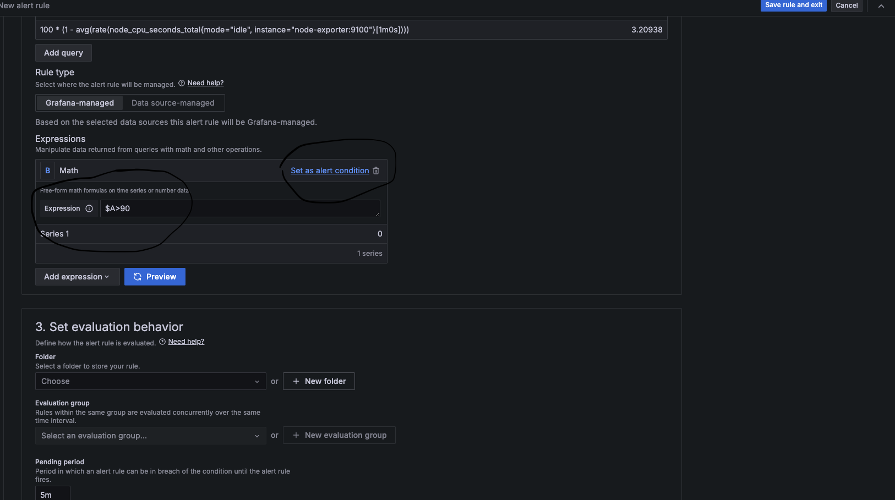

# Comprehensive Guide: Configuring Prometheus and Grafana for Dockerized Applications

## Introduction:
This guide provides comprehensive instructions for configuring and managing a monitoring solution using Prometheus and Grafana for dockerized applications. It covers setting up Prometheus and Grafana, creating dashboards, configuring alerts, and optional improvements for enhanced functionality.


## Pre-requisites:
Before proceeding, ensure you have the following prerequisites installed on your system:

1. Docker
2. Docker Compose
3. Necessary updates for Docker configuration
4. Edit the Docker configuration file and replace credsStore to credStore in ~/.docker/config.json (I got an error while using Docker Compose for the first time. BTW, I am using Docker version 25.0.3).

This documentation will be in two steps:
1. Setting up monitoring solution by using Prometheus & Grafana for our environment.
2. Building Dashboards and creating alerts wherever we feel necessary.

# Step 1: Setting Up Prometheus and Grafana:
## Adjusting Caddyfile Configuration:
Before configuring Prometheus and Grafana, make adjustments to the Caddyfile configuration to ensure proper metrics exposition:

```bash
{
	servers {
    	metrics
    }
    admin :2019
}

:80 {
  reverse_proxy http-dummy-service:8080
}
```

For ensuring consistency, a docker network ("backend") is applied to all the services in the compose file.


## Configuring Prometheus:

Prometheus is an open-source monitoring and alerting tool that is designed for reliability and scalability. It is primarily used to collect and store time-series data (metrics) from various sources, such as applications, services, and systems.
1. Install Prometheus on the server. 
2. Configure Prometheus to scrape metrics from desired targets by editing the prometheus.yml file.

## Configuring Grafana:

Grafana is an open-source visualization and monitoring platform that allows users to create, explore, and share dashboards and visualizations of time-series data. It supports various data sources, including Prometheus, allowing users to visualize metrics collected by Prometheus and other monitoring systems.
1. Install Grafana on the server.
2. Configure Grafana to connect to Prometheus as a data source.


## Additional tools/configurations:

1. Install Prometheus node-exporter for collecting all the system level metrics (CPU, memory, disk, etc.) from the host machine and makes them available for Prometheus.
2. Install push gateway for collecting short-lived service level batch jobs to an intermediate jobs which prometheus can scrape.

I am using Prometheus & Grafana official docker images from dockerhub in our docker-compose file along with volumes and some necessary environmental variables as you can see below:

```bash
#docker-compose.yaml
version: '3'
  
services:
  http-dummy-service:
    container_name: http-dummy
    image: rgjcastrillon/http-dummy-service:0.1.0
    ports:
      - 80:8080
    networks:
      - backend
  caddy:
    image: caddy:latest
    ports:
      - 8080:80
      - 2019:2019
    networks:
      - backend
    volumes:
      - ./Caddyfile:/etc/caddy/Caddyfile

  prometheus:
    image: prom/prometheus:latest
    ports:
      - 9090:9090
    networks:
      - backend
    volumes:
      - ./prometheus.yml:/etc/prometheus/prometheus.yml
  grafana:
    image: grafana/grafana
    container_name: grafana
    restart: unless-stopped
    ports:
      - 3000:3000
    environment:
      - GF_SECURITY_ADMIN_PASSWORD=password
      - GF_SMTP_ENABLED=true
      - GF_SMTP_HOST=smtp.gmail.com:587
      - GF_SMTP_USER=someone@gmail.com
      - GF_SMTP_PASSWORD=<app_password>
      - GF_SMTP_FROM_ADDRESS=someone@gmail.com
      - GF_SMTP_TLS_ENABLED=true
      - GF_SMTP_SKIP_VERIFY=true  # Note: This is needed if you're using Gmail 
    networks:
      - backend
  node-exporter:
    image: prom/node-exporter:latest
    container_name: node-exporter
    restart: unless-stopped
    volumes:
      - /proc:/host/proc:ro
      - /sys:/host/sys:ro
      - /:/rootfs:ro
    command:
      - '--path.procfs=/host/proc'
      - '--path.rootfs=/' 
      - '--path.sysfs=/host/sys'
      - '--collector.filesystem.mount-points-exclude=^/(sys|proc|dev|host|etc)($$|/)'
    expose:
      - 9100
    networks:
      - backend
  pushgateway:
    image: prom/pushgateway
    container_name: pushgateway
    restart: unless-stopped
    ports:
      - 9091:9091
    networks:
      - backend

networks:
  backend:
```
Prometheus.yml:

This file configures Prometheus to collect metrics from different sources:

1. Global Settings: Defines the global scrape interval, indicating how often Prometheus should scrape metrics from configured targets (every 5 seconds in this case).
2. Scrape Configurations: Specifies the jobs Prometheus should scrape metrics from:
3. caddy: Scrapes metrics exposed by the Caddy server on port 2019.
4. node-exporter: Collects system-level metrics from Node Exporter running on port 9100.
5. pushgateway: Gathers metrics pushed by batch jobs to the Pushgateway on port 9091.

```bash
#prometheus.yml
global:
  scrape_interval: 5s

scrape_configs:
  - job_name: "caddy"
    static_configs:
      - targets: ["caddy:2019"]
  
  - job_name: “node-exporter”
    static_configs:
      - targets: ["node-exporter:9100"]

  - job_name: "pushgateway"
    static_configs:
      - targets: ["pushgateway:9091"]
```
Once, all the changes to the docker-compose, Caddyfile, and a new prometheus configuration has done, run the docker compose file by using "docker-compose up -d"
This command will download the required Docker images and start the containers defined in the docker-compose.yml file in detached mode (-d).


Check your docker ps to check all the containers are up & running. 


Once the containers are up and running, you can access prometheus via your web browser at http://localhost:9090 and grafana at http://localhost:3000.

You can check the below screenshots for prometheus & grafana webpages:


# Step 2:

Our Second step is to create dashboards based on our requirements. But before creating dashboards, we have to add prometheus as a data source in grafana
After logging in to Grafana, add Prometheus as a data source:
Click on the gear icon (Connections) on the left sidebar, then select "Data Sources".
Click on "Add data source", select Prometheus, and configure it with the URL http://prometheus:9090.


## Dashboards:

I created dashboards in Grafana based on monitoring requirements:


### 1. CPU Usage Dashboards

Displays CPU utilization across servers to monitor system load and identify performance bottlenecks.

```bash
PromQL query: 100 * (1 - avg(rate(node_cpu_seconds_total{mode="idle", instance="node-exporter:9100"}[$__rate_interval])))
```
### 2. Memory Usage Dashboards

Shows memory utilization across servers to track memory usage trends and detect memory leaks.

```bash
PromQL query: (1 - ((node_memory_MemFree_bytes{instance="node-exporter:9100",job="node-exporter"} + node_memory_Buffers_bytes{instance="node-exporter:9100",job="node-exporter"} + node_memory_Cached_bytes{instance="node-exporter:9100",job="node-exporter"}) / node_memory_MemTotal_bytes{instance="node-exporter:9100", job="node-exporter"})) * 100
```

### 3. Disk Space Dashboards

Monitors disk space usage to prevent potential outages due to disk space exhaustion.

```bash
(node_filesystem_size_bytes{fstype!="tmpfs"} - node_filesystem_free_bytes{fstype!="tmpfs"}) / node_filesystem_size_bytes{fstype!="tmpfs"} * 100
```

### 4. Network Traffic Dashboards

Displays incoming and outgoing network traffic to identify network congestion or abnormal traffic patterns.

```bash
sum(irate(node_network_receive_bytes_total{device!="lo"}[5m]) + irate(node_network_transmit_bytes_total{device!="lo"}[5m])) by (device)
```

### 5. Caddy Web Service Health Dashboard

Indicates whether the Caddy Service is up & running.

```bash
caddy_reverse_proxy_upstreams_healthy
```

### 6. Http Service Health Dashboard

Indicates whether the HTTP service is up & running.

```bash
sum(rate(promhttp_metric_handler_requests_total{code!="200",instance="caddy:2019"}[10m]))
```

### 7. Latency Dashboard

Monitors latency, ensuring it stays within acceptable limits. 

```bash
caddy_http_response_duration_seconds_sum{code="200",instance="caddy:2019"}*1000
```

### 8. Client & Server Errors Dashboards

Client and server errors dashboards are essential tools for monitoring the health and performance of web services, APIs, or any networked applications. They track and visualize error rates and types occurring during interactions between clients (e.g., web browsers, mobile apps) and servers. Monitors client and server errors to maintain service reliability according to SLAs.

```bash
sum(caddy_http_request_duration_seconds_count{code=~"4.*"})
sum(caddy_http_request_duration_seconds_count{code=~"5.*"})
```


## Alerts

After creating the dashboards, the next important step is to create an alert rules.

### Setting Up Grafana Alerts:

Grafana alerts play a crucial role in proactively monitoring the health and performance of our applications. They allow us to define conditions based on our metrics and receive notifications when those conditions are met. Here's a step-by-step guide on setting up Grafana alerts:

Define Alert Conditions: Specify the conditions that trigger an alert based on our metrics. This can include thresholds, expressions, or aggregations.
For example, we might want to create an alert for high CPU usage when it exceeds 90% for more than 20 seconds.

Configure Notification Channels: Choose how we want to be notified when an alert is triggered. Grafana supports various notification channels, including email, Slack, PagerDuty, and more.

  


In our example, I configured email notifications using Gmail. But for configuring gmail as a notification channel, we have to pass few environmental variables before that:


```bash
environment:
      - GF_SECURITY_ADMIN_PASSWORD=password
      - GF_SMTP_ENABLED=true
      - GF_SMTP_HOST=smtp.gmail.com:587
      - GF_SMTP_USER=someone@gmail.com
      - GF_SMTP_PASSWORD=<app-password>
      - GF_SMTP_FROM_ADDRESS=someone@gmail.com
      - GF_SMTP_TLS_ENABLED=true
      - GF_SMTP_SKIP_VERIFY=true  # Note: This is needed if you're using Gmail 
```
Replace <app-password> with your Gmail app password, which you can generate under this [link](https://myaccount.google.com/apppasswords)

Create Alert Rules: Define alert rules in Grafana's alerting interface. This involves selecting the data source, specifying the metric, setting conditions, and choosing the notification channel(s).
For each alert, provide a clear description, set the threshold or condition, and specify the duration for which the condition must persist before triggering the alert.

To create an alert in Grafana, we have to follow a few steps that are shown in the following pics:

      


Test Alerts: Before deploying alerts in production, it's essential to test them to ensure they work as expected. I tried manually triggering alerts and using Grafana's built-in testing functionality to verify that notifications are sent correctly.

### Test Alert:


### Firing Alert:


### Resolved Alert:


Overall, I have created alert rules for all the dashboards created in Grafana. I have included the script for creating an alert rule is included in the monitoring/Grafana/Alert-Rules folder

Description of alerts:

High CPU Usage Alert:

Description: Alerts when CPU usage exceeds 90% for more than 20 seconds.
Threshold: CPU > 90%
Condition: 100 * (1 - avg(rate(node_cpu_seconds_total{mode="idle", instance="node-exporter:9100"}[$__rate_interval]))) > 90 for 20s

Low Disk Space Alert:

Description: Alerts when available disk space falls below 15%.
Threshold: disk_space > 85
Condition: (node_filesystem_size_bytes{fstype!="tmpfs"} - node_filesystem_free_bytes{fstype!="tmpfs"}) / node_filesystem_size_bytes{fstype!="tmpfs"} * 100 > 85

High Memory Usage Alert:

Description: Alerts when memory usage exceeds 85%.
Threshold: memory_usage > 85
Condition: (1 - ((node_memory_MemFree_bytes{instance="node-exporter:9100",job="node-exporter"} + node_memory_Buffers_bytes{instance="node-exporter:9100",job="node-exporter"} + node_memory_Cached_bytes{instance="node-exporter:9100",job="node-exporter"}) / node_memory_MemTotal_bytes{instance="node-exporter:9100", job="node-exporter"})) * 100 > 85%

Network Traffic Spike Alert:

Description: Alerts when network traffic exceeds the predefined threshold.
Threshold: network_traffic > 100MB
Condition: sum(irate(node_network_receive_bytes_total{device!="lo"}[5m]) + irate(node_network_transmit_bytes_total{device!="lo"}[5m])) by (device) > 1000000

Caddy Web Service Health Alert:

Description: Alerts when caddy reverse proxy upstreams health is down or goes to 0.
Condition: caddy_reverse_proxy_upstreams_healthy < 1

Http Service Health Alert:

Description: Alerts when promhttp metric handler requests have other than 200 code.
Condition:  sum(rate(promhttp_metric_handler_requests_total{code!="200",instance="caddy:2019"}[10m])) > 0

High Latency Alert:

Description: Normally, according to SLA, we have to make sure the latency is under 10ms or something under.
Threshold: Latency > 10 ms
Condition: caddy_http_response_duration_seconds_sum{code="200",instance="caddy:2019"}*1000 > 10 ms


Client & Server Errors Alerts:
Description: Alert when the response code is either 4** or 5**.
Condition: sum(caddy_http_request_duration_seconds_count{code=~"4.*"}) > 1
sum(caddy_http_request_duration_seconds_count{code=~"5.*"}) > 1

## Optional Improvements:

### Migration to Kubernetes:

Convert Docker Compose services into Kubernetes deployment manifests for container orchestration.

Utilize Kubernetes features like PersistentVolumes, service discovery, and resource management for improved scalability and reliability.

### Secure Credential Management with HashiCorp Vault:

Integrate HashiCorp Vault for managing sensitive information securely, including passwords, API keys, and TLS certificates.

Leverage Vault's dynamic secrets and access control features for enhanced security and compliance.

By following these steps and incorporating optional improvements, you can set up a robust monitoring solution for dockerized applications, ensuring reliability, scalability, and security in your infrastructure.
